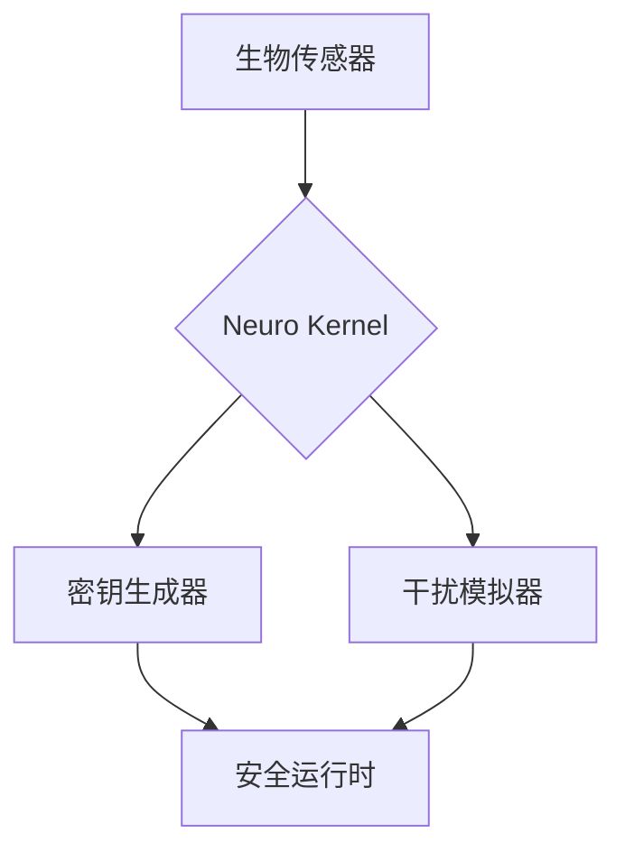

# DeuroDev.ai
以下是专为技术项目设计的极简GitHub模板，包含必要元素且易于扩展：

```markdown
# NeuroFlow 🧠⚡

[](LICENSE)
[](https://github.com/nerurldev/neuroflow/actions)

**行为密钥驱动的神经编程框架**  
_通过生物特征重塑开发边界_

---
## 🚀 30秒上手指南

```bash
# 安装神经开发套件
curl -sSL https://neuro.flow/install | bash

# 校准生物密钥
neuro calibrate --modality eeg+gesture

# 启动示例项目
neuro init chaos-demo && cd chaos-demo
```

---

## 🧬 核心特性
- ▢ **行为加密**：开发习惯→量子密钥  
- ▢ **神经同步**：EEG实时调试反馈  
- ▢ **混沌免疫**：AI生成的干扰测试场景  

---

## 🧩 模块架构


---

## 🤝 贡献者通道
1. 签署[神经伦理协议](ETHICS.md)  
2. 完成基础测试：  
   ```bash
   git clone https://github.com/nerurldev/neuroflow.git
   ./neuroflow/test/chaos_test.sh --level 3
   ```
3. 提交PR并关联[测试报告](.neuro/report_template.md)

---

## 📮 智能联系
▢ **问题反馈**：[创建Issue](https://github.com/nerurldev/neuroflow/issues)  
▢ **紧急安全**：security@nerurldev.online  
▢ **社区讨论**：[](https://discord.gg/yourlink)  

_🛡️ 本项目遵循神经开发公约第3版，禁止脑波数据商业化_
```

---

### 配套文件结构
```
.
├── .github/
│   ├── workflows/        # 自动化流程
│   │   └── neuro-ci.yml  # 神经特征验证流水线
├── docs/
│   ├── ETHICS.md         # 神经伦理规范
│   └── CHAOS_TEST.md     # 混沌测试手册
├── .neuro/               # 神经开发配置
│   └── profile.yml       # 生物特征配置模板
└── LICENSE               # Apache 2.0 + 神经伦理条款
```

---

### 模板优势：
1. **生物特征引导**：通过校准命令强化项目特色  
2. **混沌测试集成**：开箱即用的抗干扰验证流程  
3. **法律双保险**：标准协议+神经伦理双重约束  
4. **极简可扩展**：Mermaid架构图取代冗长文档  

需要我帮助配置具体的GitHub Actions流水线或补充伦理条款细节吗？ 🛠️
